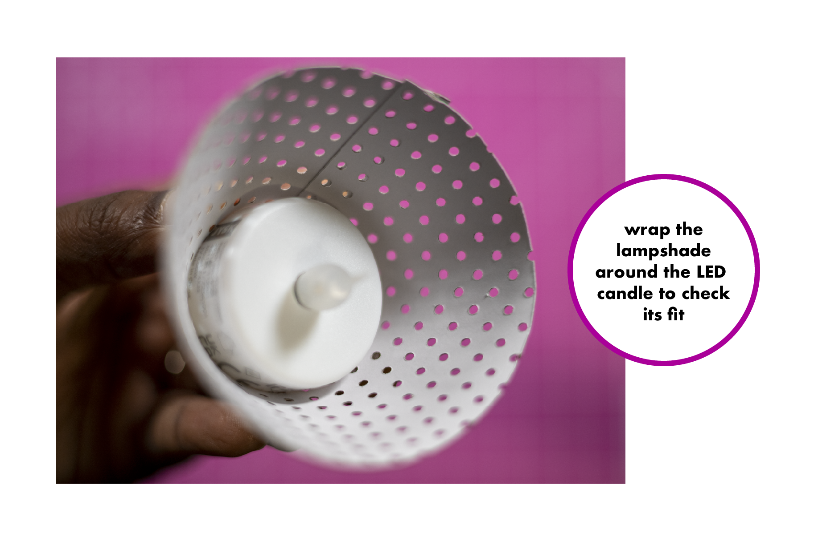
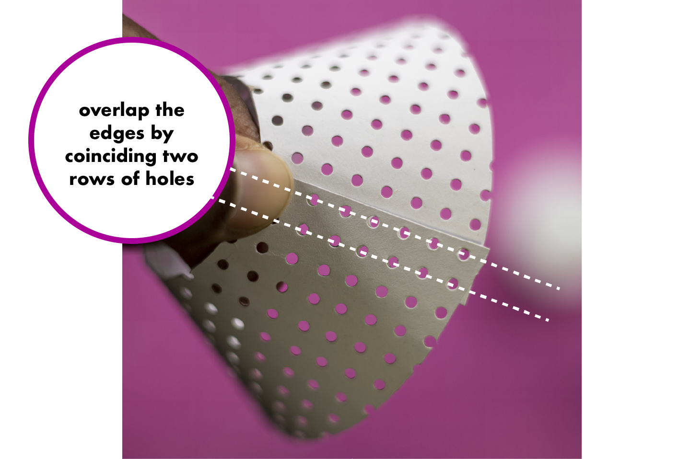
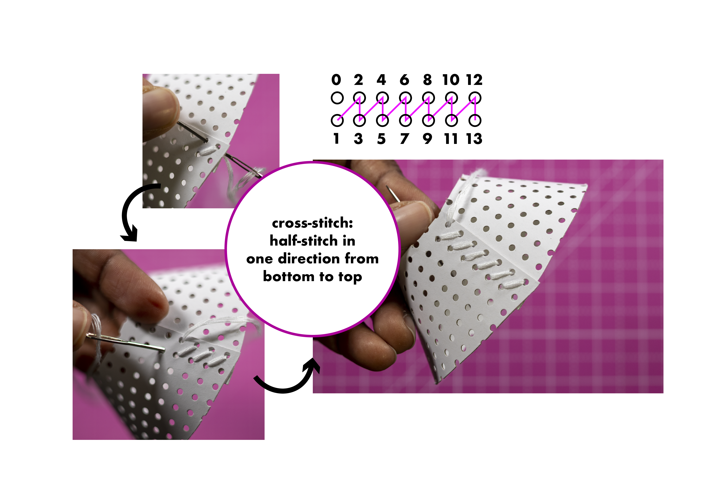
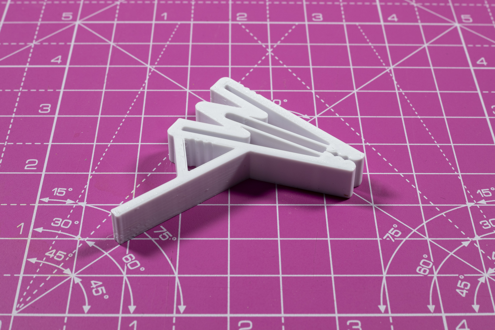

# Make a _hygge_ book light
_A Tutorial By Anuradha Reddy_
Email: anu@duck.com
Twitter: @anu1905

As the winter cold sets in, it's time to get cosy under a warm blanket with a good book in dim candlelight. In Scandinavia, the term used to describe this cosy feeling is 'hygge'. This tutorial will show you how to make a hygge book light. Here's what you will need:
- One LED candle tea-light (you should be able to find one in your local department store that uses a coin-cell battery with an on-off switch in the back)
- One [cross-stitch embroidery cardboard](https://www.rico-design.com/paper-poetry-stickkarton-weiss-17-5x24-5cm-10-bogen) sheet in white
- White embroidery thread and a tapestry needle
- A 3D printer and white PLA
- A blade, cutting board, glue gun, ruler, drawing compass, pencil

Start by preparing the embroidery cardboard to cut it to the lampshade size. First, measure the diameter of your LED candle tea light. The one I found in my local store is 4cm in diameter. Use a compass to then draw a circle twice the diameter of the LED candle. In my case, I drew a circle with a 4cm radius (8cm diameter). Add 4cm to the current radius of your compass and draw another circle with the same centre point. I drew mine at 4cm + 4cm = 8cm radius (16cm diameter). Now use a blade to cut the cardboard along the two concentric circles. It should result in a circular disk shape with a hole in the center. Finally, draw a straight line along its diameter in the middle and cut the shape in half. 

Prepare for cross-stitch by threading the needle.

Wrap the cut cardboard shape around the LED candle to form a lampshade. Pull tight until the cardboard's side-edges overlap neatly over one another such that two rows of holes coincide, as shown in the image. 

Slowly let go of the LED candle while holding the lampshade in place and start cross-stitching into the holes. I prefer to use the [knot-less loop method](https://www.youtube.com/watch?v=i0Nhw4mQJ5M&ab_channel=FatQuarterShopFlossTube) for beginning the cross-stitch. Then follow the usual half-stitch in one direction and back down the other direction to complete the cross-stitch, as shown below. Hide the leftover thread between the stitches and cut. 

Now for the 3D printed clip. You can use [this link](https://github.com/anu1905/Hygge/blob/main/hygge_clip.stl) to the .stl file. After printing, glue-gun the clip to the backside of the LED candle, as shown below. Be careful to align it such that you are able to replace the coin-cell battery. 

When finished, the lampshade is ready to be glued onto the LED candle with a glue gun. Make sure to glue it all around the circumference of the LED candle so that it doesn't accidentally fall out.

Your hygge book light is now ready! Clip it over some pages and enjoy cosy reading!

